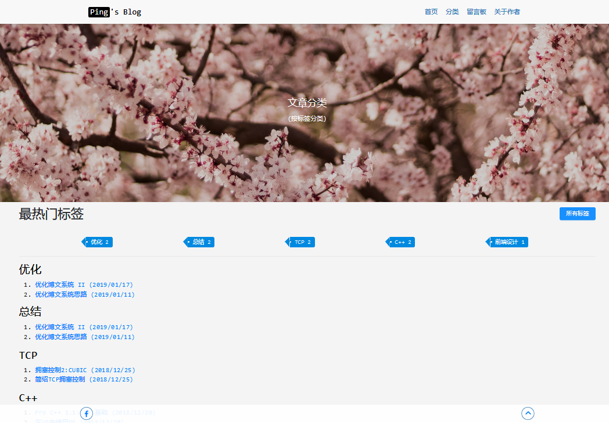
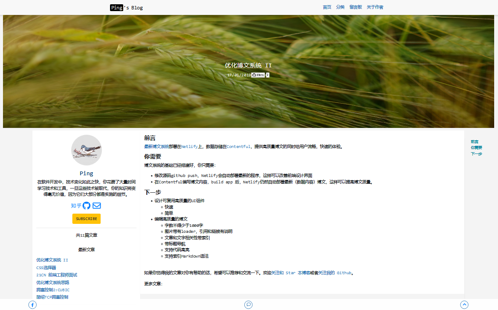
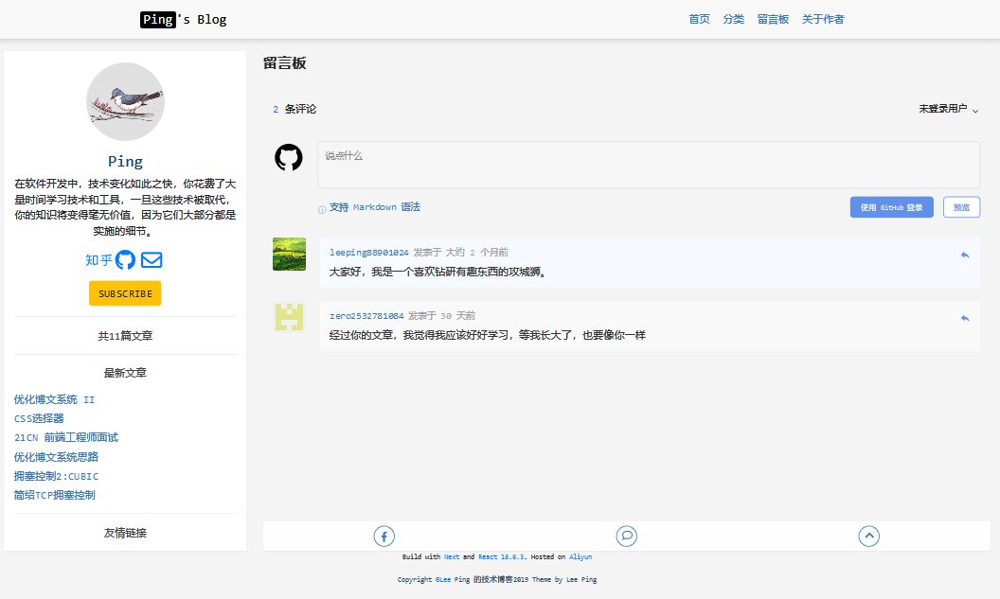

首先，是以目前的状态来写的，也是基于现在对一些东西的理解，而理解是相对的，所以有些想法会迭代或者交织，那都是正常的。编辑的思路很简单，就是我对编程的理解——当前声明、陈述、语句、段有其作用域，仅在作用域有效，为的是解决当前域所遇到的问题，以此构建一个复杂庞大的体系。就像这篇文章，它是记录我一个阶段的一篇文章，而不是其他什么东西。以后的博文都将按照这个思路书写。

本在第一版本的博客中，就有写2018年总结的计划了，但是当时的状态不是很好，总结的思路没有形成。现在林林总总有点想法，趁着在过年前，抓住2018的尾巴写点什么，以此记2018年得失的同时表对2019年的期待。上周受班长的婚礼邀请，婚礼现场看到很多多难未见的同学。同学毕业后的初次见面没有哑然以对、无可奈何，而是谈笑风声、久别重逢。婚礼期间同他们聊的同时，又给我打开了另一个窗户，这是此次我写总结的动机之一。

“2018年总结怎么写？”这已是几个月前就思考的问题，如果按照企业或者公司的方式，未免死板迂腐，总结最终是发布在发布在个人博客上而非向组织或者上级汇报，故不以这样的方式书写。我想用个人灵活轻松的方式加之与正规文书的严整性书写我2018年的总结。

时光是一条隧道，它可以连接过去和现在。忘不了大学的学习时光，更忘不了的是同学[1]送我上车回故乡的景象，很感激自己能够收获这样的友谊，知己~，希望不久的以后可以见到他们，彼此聊聊这些年来发生的变化，谈笑间，深深地感受这份友谊。

### 感想
大三直到现在，不能忽略《红楼梦》这本小说的影响，有那么几段时间，似乎忘不了“大观园”世界：里面的宝玉对大观楼外的世界是这样理解的——“”；对教育是这样理解的——“”。由此我对社会和大学的学习产生了影响，毕业求职是“走求名利无双地，打出樊笼第一关”。直到后来，因为喜欢，反复的阅读各种版本，听他人的评说和生活中的理解，以促成我现在的认知。但现在的我是不愿意读它，反而喜欢把它当成秘密珍藏起来，不愿让外人发现它或者提及它。这是我从《红楼梦》里读到青春和成长的故事。

时光如水，而我愈加感到迫切了。如很多同学一样，入职后有施展才干的强烈诉求，以此在职业生涯中能有一个好的职业开端。但“千里马常有，而伯乐不常有。”加之工作中有些问题上难有突破[2]，真是时光如水啊。而不得不有几分“年与时驰，意与日去”的担忧。最后，步入中年时如这篇文章（可能多虑了。。）中描述的状态一样：
> 中年人是艰难的。青年时代的理想主义已经消退，健康和活力也不可避免地有一点降低，但是承担的责任却在增长， 再加上一些对死亡的恐惧和一些对活着的恐惧，你就有了叫做中年危机的东西。

我想再引用[ruanyf老师](https://github.com/ruanyf)weekly第一期的金句，我想我编辑第一篇博文时的想法和他编辑第一期weekly时是相似的。
> 人生就像玻璃窗上的苍蝇，前途一片光明，却找不到出路。

同时用一句话说明我在做的事：

> 人一生最大的幸运，就是在年富力强时发现了自己的人生使命。（茨威格《人类群星闪耀时》）
### 工作
有时我在想人是不是一定要工作？最后答案是不一定要工作。因为它与年龄、环境有关，假如50岁了你还在工作，那可能是不正常的。这里的工作是雇佣制度——给别人打工。很难想象50岁的时候老板问你为什么你还在工作~。程序员这个职业和年龄是有关系的，这是市场的现状，它偏向于年轻人，到那时候你必须将职业方向转向计算机行业内的其他职业。

#### 数据库
Oracle数据库是一开始接触的数据库，Oracle SQL是出入职场时学习应用的。数据库作为应用数据部分提供存取数据的接口，如果仅存取数据的话那再简单不过了，但回顾学习和应用的经历，数据库的目的不仅仅是存取数据，它应更好的用于对数据完整性要求较高的应用时，将业务代码写成数据库内的存储过程。这样，把与业务有关的所有过程和数据作为重点了，这些也是数据库应用的核心。此外，数据库还提供了数据的备份、容灾处理、和数据分析等功能。到目前所接触项目中，数据备份、容灾处理是没有接触到的，数据库管理将是我接下来的一个课程。

数据库是自描述的，关系型数据库无非实体和关系。在Oracle里，实体就是表，关系就是表之间的关系，所以，表也是自描述的，因此，你只需要关注细表，因为它才是真正描述的对象。对非关系型数据库理解是我接下来的一个课程。

#### 应用环境
目前开发应用所接触到的环境大致如下所示，手机端开发是接下来的一个课程。

环境 | 应用 
-|-
.NET Framework | Windows桌面应用
Qt | Windows桌面应用
Node.js |  	Web开发
#### 语言
语言重要，但也不重要。重要因为他是最为基础的，不重要因为你仅靠语法是不行的，很多想法需要从零开始实现，完成一个大型的项目几乎不可能。

类别 | 语言 |  应用 
-|-|-
脚本 | JavaScript | 全栈Web开发 |
标记语言| HTML、CSS、SASS |  |
数据库语言 | SQL & PL/SQL | 数据库端开发 |
通用语言 | C# |  Windows WPF 应用开发 |
&nbsp;| C/C++ | Windows Qt Quick 应用、DLL开发 |

#### Web开发
现在前端开发越来越复杂，前端的数据流是这部分的难点。

类别 | 工具
-|-
前端框架 | React.js、Next.js、Gatsby.js
前端构建工具 | Webpack
前端数据流 | GraphQL、Redux
Web服务器 |  Express.js

上面的表格是这一年里学习并在项目中实践过的，虽然用过，并且从知识面看上去挺广，但正因为广，知识的深度不够，基本功不行，不行。我想这正也是职业所忌讳的吧，从项目的经验来看，项目本身是不关心技术的，同一个项目有多种不同的技术实现。站在一个求职者的角度，你应该学习更多新的东西，开发出更多优秀的作品。此外个人认为C\C++在编程中是重要的，应该学习并且应用。

#### 过程
工作的一年半里开发过：Windows应用（企业数据库应用）、Web应用（企业数据库应用）、数据库（开发）。按接触技术的先后列出了下面的内容：

1. SQL、PL/SQL、APEX、Oracle
2. C#、WPF
3. React.js、JavaScript、Express.js
4. Next.js、MongoDB、Gatsby.js
5. Review CSS、Three.js
6. C++、Qt

上面的技术在项目中用到外，我还开发了两个本部的博客,第一个版本大概如下，第二个版本的博文既是选择看到的。与第一个版本博文相比，它更加简单，目的是可以带来流畅的用户体验、质量较高的博文内容。

- 博文首页
- 分类
- 文章
- 留言

#### 结语
工作是实现一个人价值的方式，但不是唯一的。人生的每一个阶段有每个阶段的诉求，有这个阶段具有的悲喜和忧愁，在默默承受这些成长的同时，应该为下一个阶段做好充足的准备。未来是不可预知的，你应该采取什么样的态度，这是值得思考的问题。

### 你好，2019
上部分写了一些当时的感想和工作上的总结。2019，渴望拥有新的变化，不论是职业或者状态。在人际交往上，希望可以和更多的人交流，以此提高自己的口语 (@.@)，因为平时练习口语的机会真的是太少了。

### 考试
本想指学习的，但为了区别以前理解的“学习”，还是用考试吧，这也比较符合实际环境。总结以下比较符合我的考试大概有这些：

0 | 名称 | 说明
-|-|-
1|教师资格证 、 软考  | 职业|
2|IELTS| 语言
3|专业知识 | ！！
4|考研 | 升学
5|公务员 |职业

毕业时的初心是升学，会朝着这个方向努力，但如开头提到，就是为了升学，而不是其他什么。其间会面临很多现实的选择，那是正常的。

以后会写有关备考的文章。

......待续。