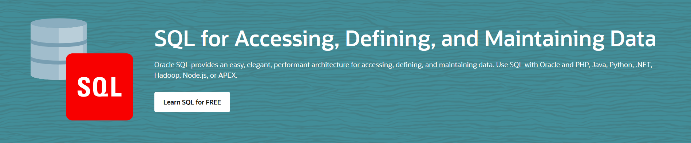

## select
select 语句用来从一个或多个表中或其他数据库对象中提取数据，一般的select语句就像这样：
```sql
select c.customer_id, 
       count(o.order_id) as orders_ct
from oe.customers c
join oe.orders o
on c.customer_id = o.customer_id
where c.gender = 'F'
group by c.customer_id
having count(o.order_id) > 4
order by orders_ct, c.customer_id ;
```

select列表列出查询的返回最终结果集中需要显示哪些列，这些列可以是数据表中一个实际的列、一个表达式、<u>或者甚至是一个select语句的结果</u>。
```sql
select c.customer_id,
       c.cust_first_name||' '||c.cust_last_name,
       (select e.last_name from hr.employees e where e.employee_id = c.account_mgr_id) as acct_mgr
from oe.customers c ;
```

### insert
insert语句用来向表、分区或视图中添加行。
```sql
insert into hr.jobs j (j.job_id, j.job_title, j.min_salary, j.max_salary)
values('IT_PM', 'Project Manager', 5000, 11000) ;

rollback;

insert into scott.bonus (ename, job, sal)
select ename,
       job, 
       sal * .10
from scott.emp ;

-- 多表插入
insert all
when sum_orders < 10000 then
into small_customers
when sum_orders >= 10000 and sum_orders < 100000 then
into medium_customers
else
into large_customers
select customer_id, sum(order_total) as sum_orders
from oe.orders
group by customer_id ;
```

### update
update语句的作用是改变表中原有行的列值。这个语句的语法由3个部分组成：update、set和where。update子句用来指定要更新的表，set子句用来指明哪些列改变了以及调整的值，where子句用来按条件筛选需要更新的行。
```sql
-- Example 1: Update a single column value using an expression
update employees2
set salary = salary * 1.10 -- increase salary by 10%
where department_id = 90 ;

-- Example 2: Update a single column value using a subquery
-- 可用于两表列数据同步
update employees
set salary = (select employees2.salary
                from employees2
                where employees2.employee_id = employees.employee_id -- 主键匹配
                and employees.salary != employees2.salary) --相同的不更新
where department_id = 90 ;

-- Example 3: Update single column using using subquery in WHERE clause to determine which rows to update
update employees
set salary = salary * 1.10
where department_id in (select department_id
                          from departments
                          where department_name = 'EXecutive')  ;

-- Example 4: Update a table using a SELECT statement to define the table and column values
update (select e1.salary,
               e2.salary as new_sal,
        from employees e1, employees2 e2
        where e1.employee_id = e2.employee_id
          and e1.department_id = 90)
set salary = new_sal ;

-- Example 5: Update multiple columns using a subquery
update employees
set (salary, commission_pct) = (select employees2.salary, .10 comm_pct
                                  from employees2
                                  where employees2.employee_id = employees.emloyee_id
                                    and employees.salary != employees2.salary)
where department_id = 90 ;
-- 比较Example 2、Example 4、Example 5。
```
### delete
delete语句用来从表中移除数据行。
```sql
-- Example 1: Delete rows from specified table using a filter condition in the WHERE clause
delete from employees2
where department_id = 90 ;

rollback ;

-- Example 2: Delete rows suing a subquery in the FROM clause
delete from (select * from employees2 where department_id = 90) ;

rollback ;

-- Example 3: Delete rows from specified table using a subquery in the WHERE clause
delete from employees2
where department_id in (select department_id
                          from departments
                          where department_name = 'Executive') ;

rollback ;
```

### merge
merge语句可以按条件获取要更新或插入到表中的数据行，然后从1个或多个源头对表进行更新或者向表中插入行。
```sql
-- 假设由两个表employees和dept60_bonuses，两表的数据如下
select employee_id, last_name, salary 
from employees 
where department_id = 60 ;

EMPLOYEE_ID     LAST_NAME     SALARY
------------------------------------
103             Hunold        9000
104             Ernst         6000
105             Austin        4800
106             Pataballa     4800
107             Lorentz       4200

select * from dept60_bonuses ;

EMPLOYEE_ID     BONUS_AMT
-------------------------
103             0
104             100
105             0


merge into dept60_bonuses b
using (
        select employee_id, salary, department_id
        from employees
        where department_id = 60
      ) e
on (b.employee_id = e.employee_id)
when matched then
  update set b.bonus_amt = e.salary * 0.2
  where b.bonus_amt = 0
  delete where (e.salary > 7500)
when not matched then
  insert (b.employee_id, b.bonus_amt)
  values (e.employee_id, e.salary * 0.1)
  where (e.salary < 7500)

select * from dept60_bonuses ;

EMPLOYEE_ID     BONUS_AMT
-------------------------
104             100
105             960
106             480
107             420
```
