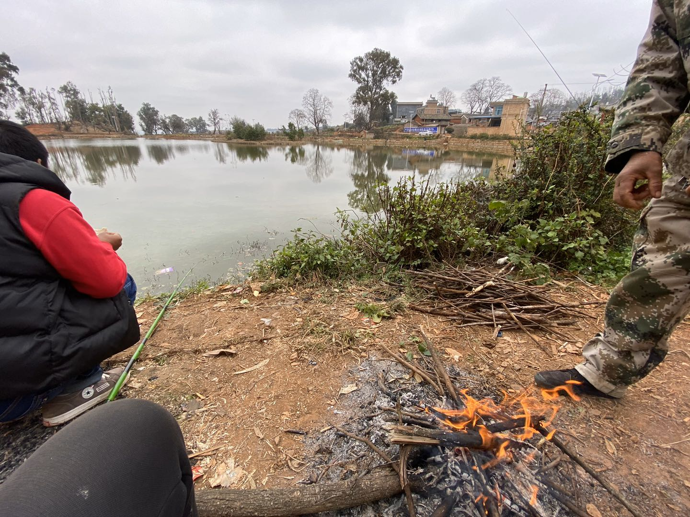

[更新于2020-03-11 6:26清晨] 
虽然我很想把全部想的东西记录下来，但有时不想掩盖那些真实、真正想表达的想法，所以，记录的内容它可能是零散、碎片化的，或者是跳跃的，有些还指明要点，这都是故意的，并非不把事情说明。

随着年龄的增长，一个人接受到的讯息越来越多，在这里，我强调的是数量：多。在这种情况下，有时候讯息它似乎更多的在肢解和透析你（的思想），而不是在乎讯息本身包含的内容是否对你具有重要的意义。就这样，在自个儿身上得出一个结论：（应该）主动有意识的减少互交，尽管减少的讯息对你是有用的。比如他宁可看手机的讯息也不愿搭理同事的讯息，按道理，和人的互动比手机上的讯息更实际且有效用。但对于个人而言，减少的东西似乎是感情，在效率和现实面前它变质了（时事），尽管还追求感情它给人带来喜悦、轻松舒畅。最后，其实我想说的是一句俗话：人长大，事儿多，精力有限，管不了那么多！这里我强调的是“管不了”、“多”，“多”更多的是指感情的事儿。有些人看了是自闭，有些人看了是自我，有些人还觉得您颓废不上进了呢，谁又能给个准。

> 别纠缠、别怀念、去改变。——copy.

[更新于2019-02-22] 
为什么现在又想着写点东西了呢？因为放假加上当时疫情的情况不太乐观在老家呆了整整1个月，在老家基本每天除了煮饭吃什么都不用做，事情是极少的，实在呆不住了，在河边上钓了3天的鱼。下面是我钓鱼时候的照片，旁边穿红色衣服的人是邻居家要好的朋友，我们多年未见，聚在一起很欣慰。那天实在是太冷了，我在一边钓鱼，让朋友在旁边把火给拢起来御寒，嘴馋了还可以直接烤鱼吃呢。就这样，钓了3天的鱼，鱼也吃了三天。

在家里实在闷得慌了，就去野地里走走，呼吸些新鲜的空气。像这样也玩了几天。

要说在家里办了几件正事，还是有那么几个的。头一个是家里的事基本理清了，就是这么个理儿，得这样办。第二一个便是我自个儿得问题还没有解决，现如今26岁大个小伙子，按理是成家的时候，但没个真正属于自个儿的栖身之所！现基本成家的，不是哪门哪户是父母操办的，但到了咱家不同，咱家的境况和别家不一样。三孩子只得儿靠自个儿，再说两个哥哥也是指望不上的，就此出现不少问题也解决了不少问题。

现在我遇到的困扰是......。钱太少，可能长这么大，即使在最窘迫、捉襟见肘时候都，对钱的渴望都没有现在这么大。是什么原因促使有这样的渴望每个人的情况不一样在此不便表述。如果非要做个说明的话，那就是：恐惧。

我此时得感想写在这里，目的是时刻警醒自己不应该做什么，有时认识到不应该做什么比知道做什么要重要得多，也为记录那短暂得记忆。

[更新于2019-12-25] 
三年前刚毕业，面临择业的问题，那时候最在乎的是我将会在什么样的地方工作，接触什么类型的人，自己会成为怎么样的人。这种想法的起源和出生成长的环境有关，出生在郊县的小村庄，给我影响深刻的是农村人因生活的压力而表现出各种矛盾的常态，直接导致现在的我对家庭婚姻有点后怕—后怕亲密关系产生的矛盾。这是我进入社会前对家庭生活最原始的想法。

现在，我26岁。

