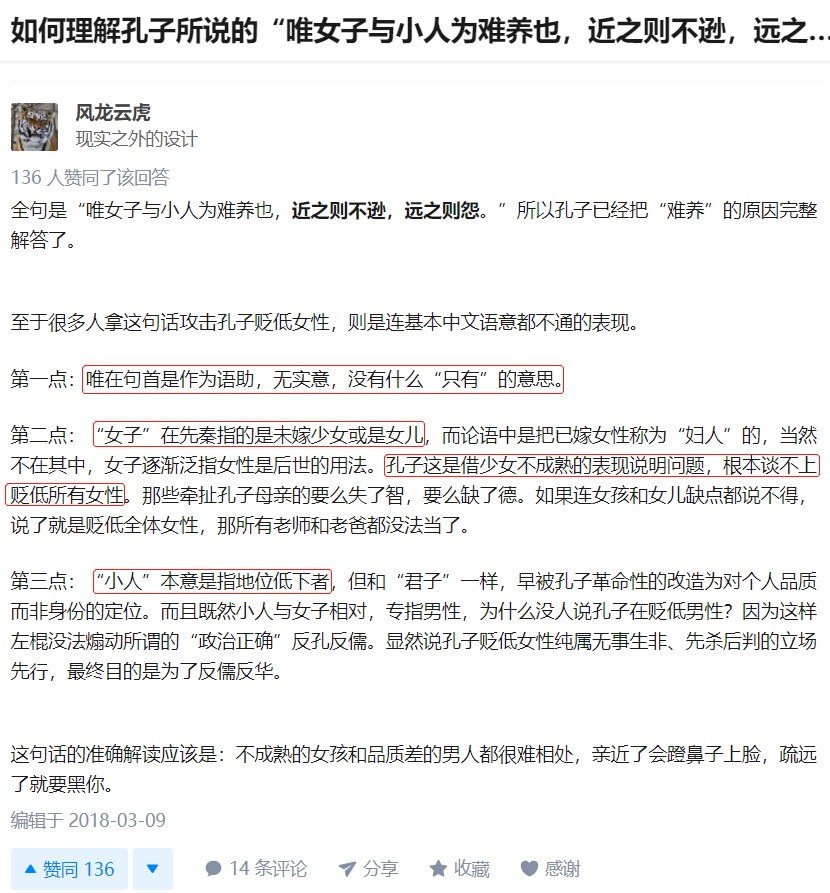

我们人的一生最后都会和另一个未知的人走到一起，彼此生活渡过人生不同的阶段。

我渴望并期待和我相遇的人。

最近，我有一个感受，和年轻点的异性相处真是何其的困难。突然想到《论语》里的一段话。
[唯女子与小人难养也](https://baike.baidu.com/item/%E5%94%AF%E5%A5%B3%E5%AD%90%E4%B8%8E%E5%B0%8F%E4%BA%BA%E9%9A%BE%E5%85%BB%E4%B9%9F/155358?fr=aladdin)。

> 子 曰：“ 唯 女子 与 小人 为难 养 也， 近 之 则 不 孙， 远 之 则 怨。”
>
> 女子与小人，他们都很难培养自己的浩然正气，难养身、心、性、命，所以与之相处要有远近分寸，太近了容易失礼，坏了规矩；过于远离，又容易招致怨恨，而不利于儒学的传承。

这恐怕是难得的翻译了，很多出版的《论语》都把这句的意思翻译错了，以至于让后人产生了误解。

